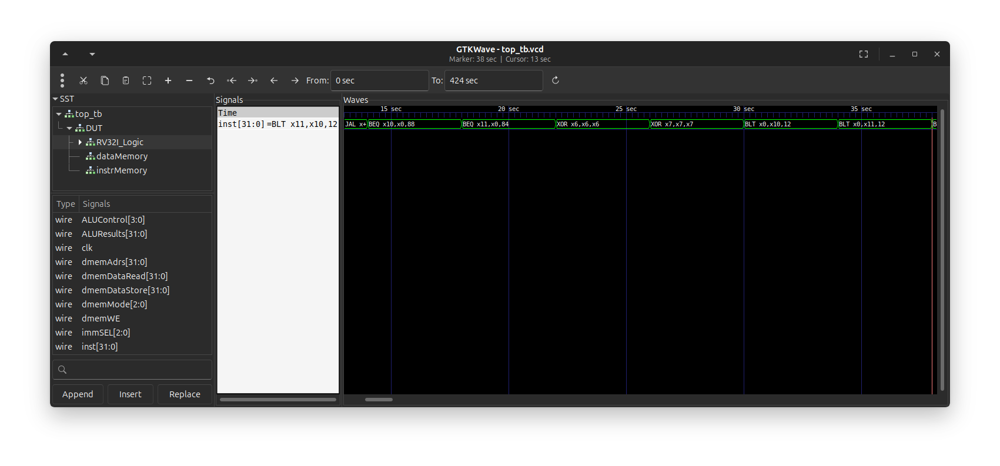
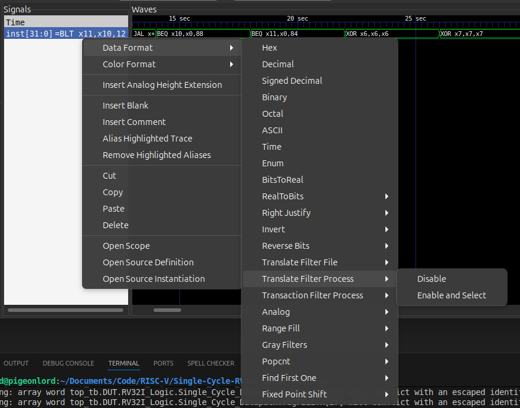

# RISCV-32I GTKWave Filter

This repo is for building a *Translate Filter Process* for RV32I. This repo uses my custom RV32I compiler made in python. The same approach used in this repo can be used with any other compiler with some configuration. 



## Cloning

``` bash
git clone --recursive https://github.com/PebPeb/riscv-32i-gtkwave.git
```

## Building

Building may require some configuration and installation of dependences in python environment. This processes is currently not documented.

``` bash
make
```

The make file will compile the python script into an executable that GTKWave can use. The executable is placed in the `dist/` directory.

## Using

Data Fromat -> Translate Filter Process -> Enable and Select



This will open up a window from that window click `Add Trans Filter to List` and select the compiled executable. After adding the file **select** it and then press `ok`. If you do not select the file before clicking okay it will not apply the filter.
